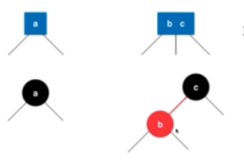
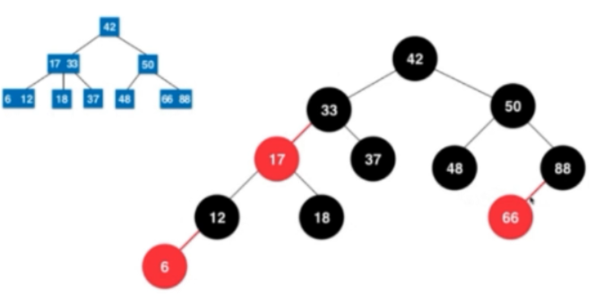
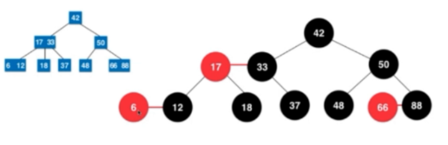

## 查找  

1.二叉树在极端情况下搜索性能会变N

2.平衡二叉树搜索性能始终能保持logN

### 2-3树(B-树)  

* 向2-结点插入：直接把它变成3-结点

* 向3-结点插入：

  > `无父结点`:先变成4-结点，然后分解成有两个子结点的2-节点为根的树
  >
  > `父结点为2-结点`：先变成4-结点，然后拆分，把中键放入父结点，父结点变为3-结点，其余变成2-结点、
  >
  > `父结点为3-结点`：同上，且向上不断拆分。如果沿父结点向上都为3-结点，根结点变为4-结点，对根结点执行`无父结点`操作

* 由下向上生长

* 2-和3-结点同时存在，插入情况太繁琐

### 红黑树  

* 红黑树是一种含有红黑结点并能自平衡的二叉查找树。它必须满足下面性质：

> 性质1：每个节点要么是黑色，要么是红色。
>
> 性质2：根节点是黑色。
>
> 性质3：每个叶子节点（NIL）是黑色。
>
> 性质4：每个红色结点的两个子结点一定都是黑色。
>
> 性质5：任意一结点到每个叶子结点的路径都包含数量相同的黑结点。

* 把2-3树中3-结点小的值看成红色，大的值看成黑色，拆分成只有2-结点的树

*   

*   

*   

* 空链接约定为黑链接，插入默认为红链接(红结点)

* `旋转`的本质：解决出现红色右链接的情况

* 单个2-结点插入：小于根结点则直接加到左子结点，大于则加到右子结点然后左旋转

* 向3-结点插入：

  > `大于`原来两个键，则插入黑结点的黑链接，把两个子结点全变黑
  >
  > `小于`原来两个键，则插入红结点的红链接，上层红结点的红链接右旋转后变成黑结点，把两个子结点全变黑结点
  >
  > `介于`原来两个键之间，则插入红结点的右子结点作为红结点并左旋转然后右旋转

3.子串查找

